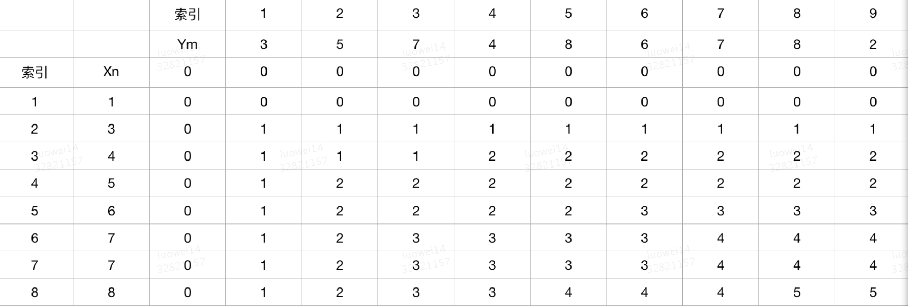

# 最长公共子序列

## 问题描述
最长公共子序列（LCS）是一个在一个序列集合中（通常为两个序列）用来查找所有序列中最长子序列的问题。一个数列 ，如果分别是两个或多个已知数列的子序列，且是所有符合此条件序列中最长的，则称为已知序列的最长公共子序列。

最长公共子序列问题是一个经典的计算机科学问题，也是数据比较程序，比如Diff工具，和生物信息学应用的基础。它也被广泛地应用在版本控制，比如Git用来调和文件之间的改变。

## 问题浅析
首先先理解一下【子序列】和【公共子序列】：

- 子序列：指的是字符串中不一定连续但先后顺序一致的n个字符，即可以去掉字符串中的部分字符，但不可改变其前后顺序。如abcdefg中，acdg，bdf属于它的子序列，而bac，dbfg则不是，因为它们与字符串的字符顺序不一致。

- 公共子序列：如果序列C既是序列A的子序列，同时也是序列B的子序列，则称它为序列A和序列B的公共子序列。如对序列 1,3,5,4,2,6,8,7和序列 1,4,8,6,7,5 来说，序列1,8,7是它们的一个公共子序列。

最后再来扩展一下【子串】的概念：

- 子串：指的是字符串中连续的n个字符，如abcdefg中，ab，cde，fg等都属于它的字串。

## 代码实现
设：X=(x1,x2,x3,...,xn) 和 Y=(y1,y2,y3,...,ym)是两个序列，LCS(X, Y)是X和Y的最长公共子序列。

### 寻找子结构
一种情况就是当 Xn === Ym 的时候，说明X的最后一个元素与Y最后的一个元素相同，说明该元素一定位于公共子序列中，所以这时问题转化为求出LCS(Xn-1, Ym-1)。

LCS = LCS(Xn-1, Ym-1) + 1

还有一种情况是 Xn != Ym 的时候，这时候分裂出两个子问题：LCS(Xn, Ym-1) 和 LCS(Xn-1, Ym)，因为Xn != Ym，说明最后一位元素不属于公共子序列

LCS(Xn, Ym-1)：最长公共子序列在(x1,x2,x3,...,xn)  和 (y1,y2,y3,...,ym-1)中

LCS(Xn-1, Ym)：最长公共子序列在(x1,x2,x3,...,xn-1)  和 (y1,y2,y3,...,ym)中

求解上面两个子问题很简单，哪个更长哪个就是最优解，即：

LCS = Max{ LCS(Xn, Ym-1), LCS(Xn-1, Ym) }

### 重复子问题
仔细观察我们拆分的三个子问题中：

1. LCS(Xn-1, Ym-1)

2. LCS(Xn, Ym-1)

3. LCS(Xn-1, Ym)

其他他们之间是有重复问题的，以第2个（LCS(Xn, Ym-1)）子问题为例，他就包含了第1个（LCS(Xn-1, Ym-1)）子问题，因为当Xn, Ym-1不同时，需要将LCS(Xn, Ym-1)分解为：

- LCS(Xn, Ym-2)

- LCS(Xn-1, Ym-1)

也就是说，继续分解子问题后，有些问题是有重复解的。是不是有种熟悉的感觉？跟我们在分析背包问题 时的思路一模一样，那接下来就剩状态转移了。

### 状态转移
依然采用我们熟悉的状态表转移，我们来画一下LCS的状态转移表

初始化表格


Xn={1,3,4,5,6,7,7,8}

Ym={3,5,7,4,8,6,7,8,2}

接下来，我们按照我们子结构来逐行完善

最后一个元素相同：LCS = LCS(Xn-1, Ym-1) + 1

最后一个元素不同：LCS = Max{ LCS(Xn, Ym-1), LCS(Xn-1, Ym) }

第一行


在这一行中，最后一个元素始终不同，所以LCS = Max{ LCS(Xn, Ym-1), LCS(Xn-1, Ym) }，恰好都为0

第二行


在这一行中 x2 === y1 时，LCS = LCS(x1 + y0) = 1, 剩下的没有再相同的元素，取 Max{ LCS(Xn, Ym-1), LCS(Xn-1, Ym) } 的值

第三行


同理，x3 === y4 时，LCS = LCS(x2, y3) + 1 = 2, 剩下的没有再相同的元素，取 Max{ LCS(Xn, Ym-1), LCS(Xn-1, Ym) } 的值

跳过中间部分直接给出完整的表




这时我们可以求出，Xn 与 Ym 最长公共子序列的长度为 LCS(8, 9) = 5

下面给出代码的实现

``` javascript
    function LCS(s1, s2) {
        let dp = (new Array(s1.length + 1)).fill().map(() => [0])
        dp[0] = (new Array(s2.length + 1)).fill(0)
    ​
        for (let i = 1; i < s1.length + 1; i++) {
            for (let j = 1; j < s2.length + 1; j++) {
                if (s1[i - 1] === s2[j - 1]) {
                    dp[i][j] = dp[i - 1][j - 1] + 1
                } else {
                    dp[i][j] = Math.max(dp[i][j - 1], dp[i - 1][j])
                }
            }
        }
    ​
        return dp
    }
```
### 打印LCS
求出LCS的长度并不难，关键是怎么把LCS打印出来。

#### 打印出一个LCS
其实思路也很简单明确：就是把所有相同的子序列递归的连接起来即可

``` javascript
    // 打印出一个LCS
    function printLCS(dp, str1, str2, i, j){
        if (i === 0 || j === 0){
            return ""
        }
        if(str1[i-1] === str2[j-1]){
            return printLCS(dp, str1, str2, i-1, j-1) + str1[i - 1]
        }else{
            if (dp[i][j-1] > dp[i-1][j]){
                return printLCS(dp, str1, str2, i, j-1)
            }else{
                return printLCS(dp, str1, str2, i-1, j)
            }
        }
    }
```
#### 打印出所有LCS
打印出所有LCS有一个地方需要我们注意：实际上 Math.max(dp[i][j - 1], dp[i - 1][j]) 是需要区分三种情况的：

- dp[i][j - 1] > dp[i - 1][j]

- dp[i][j - 1] < dp[i - 1][j]

- dp[i][j - 1] === dp[i - 1][j]

前两种情况没什么问题，哪个大就继续向上找哪个，第三种情况比较特殊，当dp[i][j - 1] === dp[i - 1][j]相等的时候，实际上 dp[i][j - 1] 和 dp[i - 1][j] 都需要去找，而结果是有可能出现重复的，所以最后的结果一定要记得去重

``` javascript
    function printAllLCS(dp, str1, str2, i, j){
        if (i === 0 || j === 0){
            return [""]
        }
        if(str1[i-1] === str2[j-1]){
            let arr = []
            printAllLCS(dp, str1, str2, i-1, j-1).forEach(s => arr.push(s + str1[i - 1]))
            return arr
        }else{
            let arr = []
            if (dp[i][j-1] >= dp[i-1][j]){
                printAllLCS(dp, str1, str2, i, j-1).forEach(s => arr.push(s))
            }
            if (dp[i][j-1] <= dp[i-1][j]){
                printAllLCS(dp, str1, str2, i-1, j).forEach(s => arr.push(s))
            }
            return Array.from(new Set(arr))
        }
    }
```
## 扩展
### 最长共子串
思考一下，怎么输出一个最长公共子串的表呢？前面我们说过，子串是连续的，也就是说只有当两个序列中的某个元素相等的时候，才去进行计数，否则的话只需要把他们“分割”开来即可，那不相等我们可以用 0 来表示

``` javascript
    function LCS(s1, s2) {
        let dp = (new Array(s1.length + 1)).fill().map(() => [0])
        dp[0] = (new Array(s2.length + 1)).fill(0)
        
        for (let i = 1; i < s1.length + 1; i++) {
            for (let j = 1; j < s2.length + 1; j++) {
                if (s1[i - 1] === s2[j - 1]) {
                    dp[i][j] = dp[i - 1][j - 1] + 1
                } else {
                    dp[i][j] = 0
                }
            }
        }
        return dp
    }
```
### 输出最长公共子串
同样的，怎么输出最长公共子串呢？

#### 输出一个

输出一个子串相对来说比较简单，我们可以采用另一种思路：如果能知道最长公共子串的长度，以及他的起始点，那么就可以打印出这个子串

``` javascript
    function LCS(s1, s2) {
        let dp = (new Array(s1.length + 1)).fill().map(() => [0])
        dp[0] = (new Array(s2.length + 1)).fill(0)
        
        let maxLen = maxIndex = 0
        for (let i = 1; i < s1.length + 1; i++) {
            for (let j = 1; j < s2.length + 1; j++) {
                if (s1[i - 1] === s2[j - 1]) {
                    dp[i][j] = dp[i - 1][j - 1] + 1
                    if (dp[i][j] >= maxLen) {
                        maxLen = dp[i][j]
                        maxIndex = i - maxLen
                    }
                } else {
                    dp[i][j] = 0
                }
            }
        }
    ​
        return {
            dp,
            LCS: s1.substr(maxIndex, maxLen)
        }
    }
```
#### 输出全部

按照上面的思路，输出全部的话其实只要找到所有最长子串的起点就可以了，我们可以回溯已知的二维表，找到所有起点

``` javascript
    // 回溯动态规划表 打印所有最长公共子串
    function printLCS(dp, str1, str2, max){
        let len1 = str1.length
        let len2 = str2.length
        let r = []
    ​
        for (let i = len1; i >= max; i--) {
            for (let j = len2; j >= max; j--) {
                if (dp[i][j] === max) {
                    r.push(i - max)
                }
            }
        }
    ​
        return r.map(n => str1.substr(n, max))
    }
    ​
    function LCS(s1, s2) {
        let dp = (new Array(s1.length + 1)).fill().map(() => [0])
        dp[0] = (new Array(s2.length + 1)).fill(0)
        
        let maxLen = maxIndex = 0
        for (let i = 1; i < s1.length + 1; i++) {
            for (let j = 1; j < s2.length + 1; j++) {
                if (s1[i - 1] === s2[j - 1]) {
                    dp[i][j] = dp[i - 1][j - 1] + 1
                    if (dp[i][j] >= maxLen) {
                        maxLen = dp[i][j]
                        maxIndex = i - maxLen
                    }
                } else {
                    dp[i][j] = 0
                }
            }
        }
    ​
        return {
            dp,
            LCS: printLCS(dp, s1, s2, maxLen)
        }
    }
```

## 参考

- [javascript 最长公共子序列](https://segmentfault.com/a/1190000012864957)
- [动态规划 最长公共子序列 过程图解](https://blog.csdn.net/hrn1216/article/details/51534607)
- [动态规划——最长公共子序列LCS及模板](https://www.cnblogs.com/wkfvawl/p/9362287.html)
- [最长公共子序列 (LCS) 详解+例题模板（全）](https://blog.csdn.net/lxt_lucia/article/details/81209962)