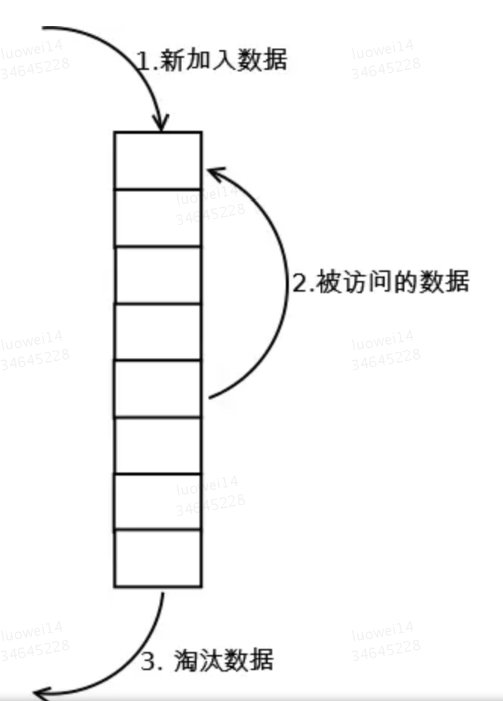
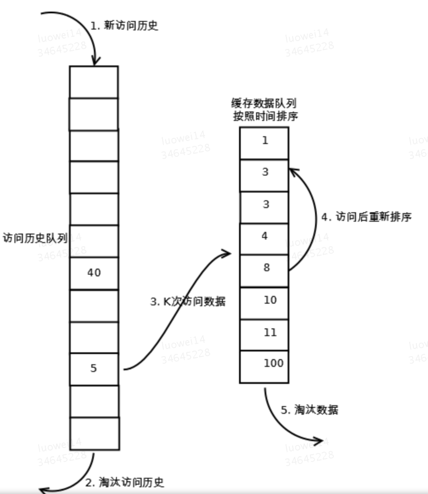
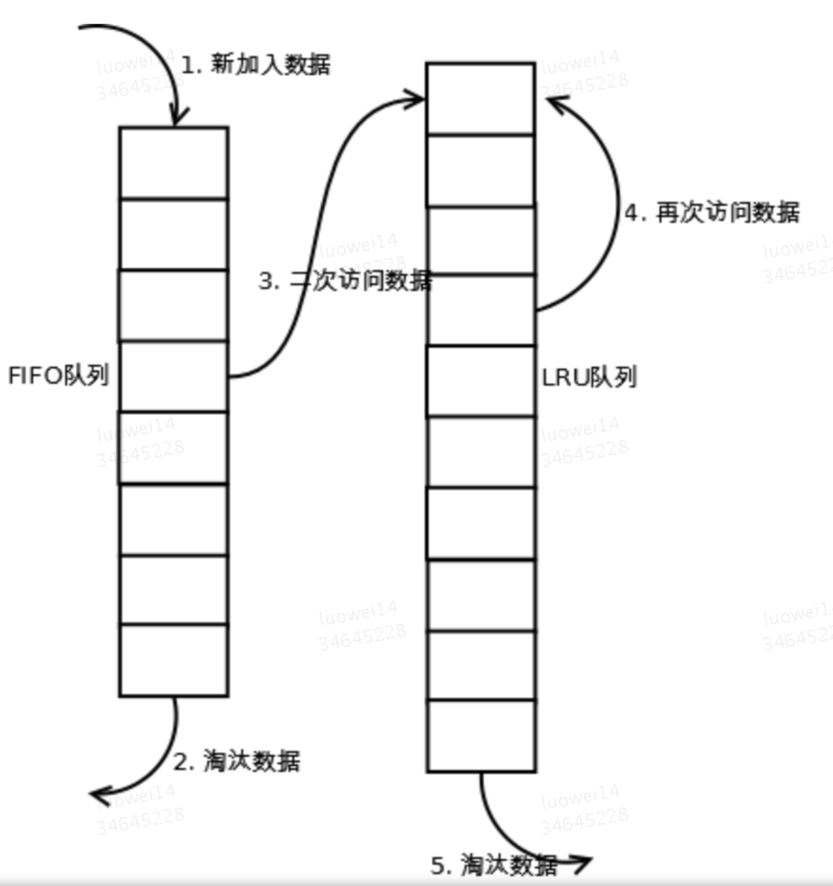
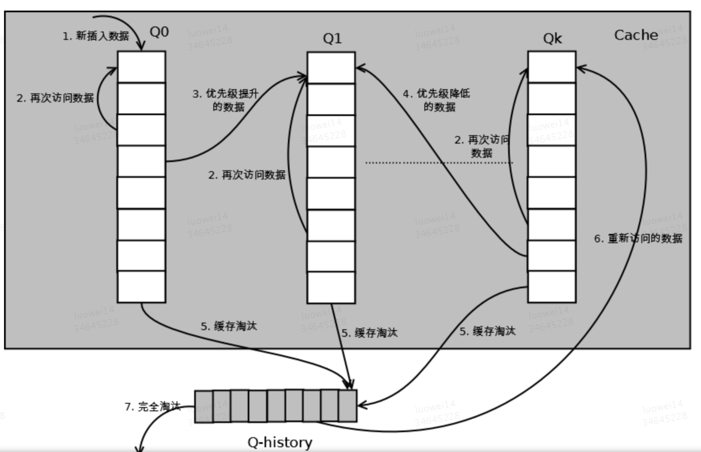

# LRU: 为什么淘汰的是我？

## 问题描述
什么是LRU算法？ LRU是Least Recently Used的缩写，即最近最少使用，常用于页面置换算法，是为虚拟页式存储管理服务的。

关于操作系统的内存管理，如何节省利用容量不大的内存为最多的进程提供资源，一直是研究的重要方向。而内存的虚拟存储管理，是现在最通用，最成功的方式—— 在内存有限的情况下，扩展一部分外存作为虚拟内存，真正的内存只存储当前运行时所用得到信息。这无疑极大地扩充了内存的功能，极大地提高了计算机的并发度。虚拟页式存储管理，则是将进程所需空间划分为多个页面，内存中只存放当前所需页面，其余页面放入外存的管理方式。

## 问题浅析
LRU的核心思想是：`如果数据最近被访问过，那么将来被访问的几率也更高`。

LRU算法有三个特征：

1.新添加的数据放在头部

2.被访问到的数据放在头部

3.超过最大缓存量的数据将被移除。



LRU的实现方式有很多种，比如：数组、链表、链表+hashmap，理解LRU的原理之后，具体的实现方式可根据实际情况而定，本期的算法讲解我们采用数组的方式。

## 代码实现
实现之前我们先来定义一下使用的api，根据api来实现我们的具体代码

假设我们有一个LRU的类

```javascript
// 实例化, 传入一些配置
const l = new LRU({ length: 3 })
// 增加数据
l.append({a: 1})
// 读取数据
l.get('k')
// 清空数据
l.clear()
// 打印数据
l.print()
```
现在可以根据我们定义的api来实现LRU这个类

首先是基本配置，还有缓存的数据

```javascript
class LRU {
  constractor(ops) {
    this.cfg = ops
    this.cache = []
  }
}
```
接下来实现LRU中核心的两个方法，增加和读取

```javascript
class LRU {
  constructor(ops) {
    this.cfg = ops
    this.cache = []
  }
 
  append(val) {
    // 根据LRU的特性，缓存未满的时候，向前插入
    if (this.cache.length < this.cfg.length) {
      this.cache.unshift(val)
    } else {
      // 缓存已满时移除哪些访问频次底的数据
      this.cache.pop()
      this.cache.unshift(val)
    }
  }
  
  get(k) {
    let idx = this.cache.findIndex(o => o.k === k)
    if (idx === -1) return undefined
    let result = this.cache[idx]
    // 将访问过的数据移动到头部
    this.cache.splice(idx, 1)
    this.cache.unshift(result)
    
    return result
  }
  
  print() {
    console.log(this.cache)
  }
}
```

到这位置其实我们已经实现了一个简易的LRU，我们可以来验证一下
```javascript
    let l = new LRU({ length: 3 })
    ​
    l.append({ k: 'a', v: 'aa' })
    l.append({ k: 'b', v: 'bb' })
    l.append({ k: 'c', v: 'cc' })
    l.print() // [{ k: 'c', v: 'cc' }, { k: 'b', v: 'bb' }, { k: 'a', v: 'aa' }]
    l.append({ k: 'd', v: 'dd' })
    l.print() // [{ k: 'd', v: 'dd' }, { k: 'c', v: 'cc' }, { k: 'b', v: 'bb' }]
```

可以看到，在添加数据的时候
当数据未溢出时，向数组头部依次添加数据
当数据溢出时，删除最少访问数据（数组尾部数据），再向头部添加

```javascript
    l.get('c')
    l.print() // [{ k: 'c', v: 'cc' }, { k: 'd', v: 'dd' }, { k: 'b', v: 'bb' }]
```

当访问某条数据的时候，除了返回这条数据，我们还会把这条数据置于数组头部，其核心思想是：如果数据最近被访问过，那么将来被访问的几率也更高 。

## 扩展分析
### LRU
【命中率】

当存在热点数据时，LRU的效率很好，但偶发性的、周期性的批量操作会导致LRU命中率急剧下降，缓存污染情况比较严重。

【复杂度】

实现简单。

【代价】

不同的数据结构代价不一样，已我们实现的数组版本为例，代价就是对数组操作的复杂度。

### LRU-K
【原理】

LRU-K中的K代表最近使用的次数，因此LRU可以认为是LRU-1。LRU-K的主要目的是为了解决LRU算法“缓存污染”的问题，其核心思想是将“最近使用过1次”的判断标准扩展为“最近使用过K次”。



相比LRU，LRU-K需要多维护一个队列，用于记录所有缓存数据被访问的历史。只有当数据的访问次数达到K次的时候，才将数据放入缓存。当需要淘汰数据时，LRU-K会淘汰第K次访问时间距当前时间最大的数据。

1. 数据第一次被访问，加入到访问历史列表；

2. 如果数据在访问历史列表里后没有达到K次访问，则按照一定规则（FIFO，LRU）淘汰；

3. 当访问历史队列中的数据访问次数达到K次后，将数据索引从历史队列删除，将数据移到缓存队列中，并缓存此数据，缓存队列重新按照时间排序；

4. 缓存数据队列中被再次访问后，重新排序；

5. 需要淘汰数据时，淘汰缓存队列中排在末尾的数据，即：淘汰“倒数第K次访问离现在最久”的数据。

LRU-K具有LRU的优点，同时能够避免LRU的缺点，实际应用中LRU-2是综合各种因素后最优的选择，LRU-3或者更大的K值命中率会高，但适应性差，需要大量的数据访问才能将历史访问记录清除掉。

【命中率】

LRU-K降低了“缓存污染”带来的问题，命中率比LRU要高。

【复杂度】

LRU-K队列是一个优先级队列，算法复杂度和代价比较高。

【代价】

由于LRU-K还需要记录那些被访问过、但还没有放入缓存的对象，因此内存消耗会比LRU要多；当数据量很大的时候，内存消耗会比较可观。LRU-K需要基于时间进行排序（可以需要淘汰时再排序，也可以即时排序），CPU消耗比LRU要高。

### Two Queue（2Q）
【原理】

Two queues（以下使用2Q代替）算法类似于LRU-2，不同点在于2Q将LRU-2算法中的访问历史队列（注意这不是缓存数据的）改为一个FIFO缓存队列，即：2Q算法有两个缓存队列，一个是FIFO队列，一个是LRU队列。



当数据第一次访问时，2Q算法将数据缓存在FIFO队列里面，当数据第二次被访问时，则将数据从FIFO队列移到LRU队列里面，两个队列各自按照自己的方法淘汰数据。

1. 新访问的数据插入到FIFO队列；

2. 如果数据在FIFO队列中一直没有被再次访问，则最终按照FIFO规则淘汰；

3. 如果数据在FIFO队列中被再次访问，则将数据移到LRU队列头部；

4. 如果数据在LRU队列再次被访问，则将数据移到LRU队列头部；

5. LRU队列淘汰末尾的数据。

【命中率】

2Q算法的命中率要高于LRU。

【复杂度】

需要两个队列，但两个队列本身都比较简单。

【代价】

FIFO和LRU的代价之和。

2Q算法和LRU-2算法命中率类似，内存消耗也比较接近，但对于最后缓存的数据来说，2Q会减少一次从原始存储读取数据或者计算数据的操作。

### Multi Queue
【原理】

MQ算法根据访问频率将数据划分为多个队列，不同的队列具有不同的访问优先级，其核心思想是：优先缓存访问次数多的数据。

MQ算法将缓存划分为多个LRU队列，每个队列对应不同的访问优先级。访问优先级是根据访问次数计算出来的，例如：

详细的算法结构图如下，Q0，Q1....Qk代表不同的优先级队列，Q-history代表从缓存中淘汰数据，但记录了数据的索引和引用次数的队列：



如上图，算法详细描述如下：

1. 新插入的数据放入Q0；

2. 每个队列按照LRU管理数据；

3. 当数据的访问次数达到一定次数，需要提升优先级时，将数据从当前队列删除，加入到高一级队列的头部；

4. 为了防止高优先级数据永远不被淘汰，当数据在指定的时间里访问没有被访问时，需要降低优先级，将数据从当前队列删除，加入到低一级的队列头部；

5. 需要淘汰数据时，从最低一级队列开始按照LRU淘汰；每个队列淘汰数据时，将数据从缓存中删除，将数据索引加入Q-history头部；

6. 如果数据在Q-history中被重新访问，则重新计算其优先级，移到目标队列的头部；

7. Q-history按照LRU淘汰数据的索引。

【命中率】

MQ降低了“缓存污染”带来的问题，命中率比LRU要高。

【复杂度】

MQ需要维护多个队列，且需要维护每个数据的访问时间，复杂度比LRU高。

【代价】

MQ需要记录每个数据的访问时间，需要定时扫描所有队列，代价比LRU要高。

注：虽然MQ的队列看起来数量比较多，但由于所有队列之和受限于缓存容量的大小，因此这里多个队列长度之和和一个LRU队列是一样的，因此队列扫描性能也相近。

### LRU类算法对比
|对比点|对比|
| ------------- |:-------------:|
| 命中率 | LRU-2 > MQ(2) > 2Q > LRU |
| 复杂度 | LRU-2 > MQ(2) > 2Q > LRU |


## 总结
实际应用中需要根据业务的需求和对数据的访问情况进行选择，并不是命中率越高越好。例如：虽然LRU看起来命中率会低一些，且存在”缓存污染“的问题，但由于其简单和代价小，实际应用中反而应用更多。

## 参考
- [LRU缓存算法实现](https://blog.csdn.net/zhushuai1221/article/details/51232394)