## 问题描述
1848年，国际西洋棋棋手马克斯·贝瑟尔提出一个著名的问题：在8×8格的国际象棋上摆放八个皇后，使其不能互相攻击，即任意两个皇后都不能处于同一行、同一列或同一斜线上，问有多少种摆法？高斯认为有76种方案。1854年在柏林的象棋杂志上不同的作者发表了40种不同的解，后来有人用图论的方法解出92种结果。

## 问题浅析
下面我们简化一下问题，假设现在只有4个皇后

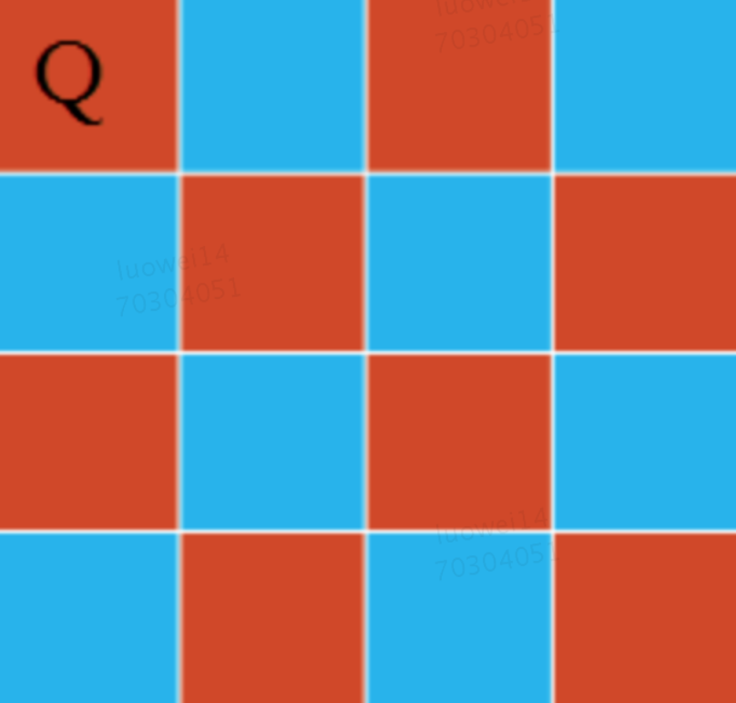

在第一行放1号皇后。第一行的四个格子都可以放。按枚举的习惯，先放在第一个格子。如下图所示。黑色的格子不能放其他的皇后。


在第二行放2号皇后，只能放在第三个或第四个格子。按枚举的习惯，先放在第三个格子，如下图所示

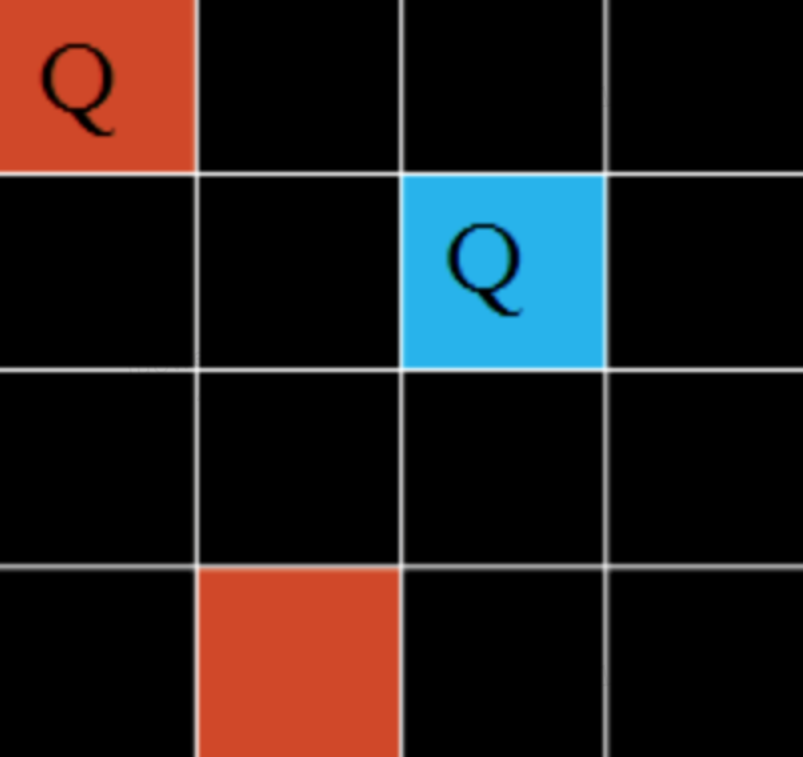

此时注意到第三行，全部变为黑色，意味着没有格子可以放置皇后了，于是在第一个皇后位于1号，第二个皇后位于3号的情况下问题无解。我们只能返回上一步来，给2号皇后换个位置，挪到第四个格子上。

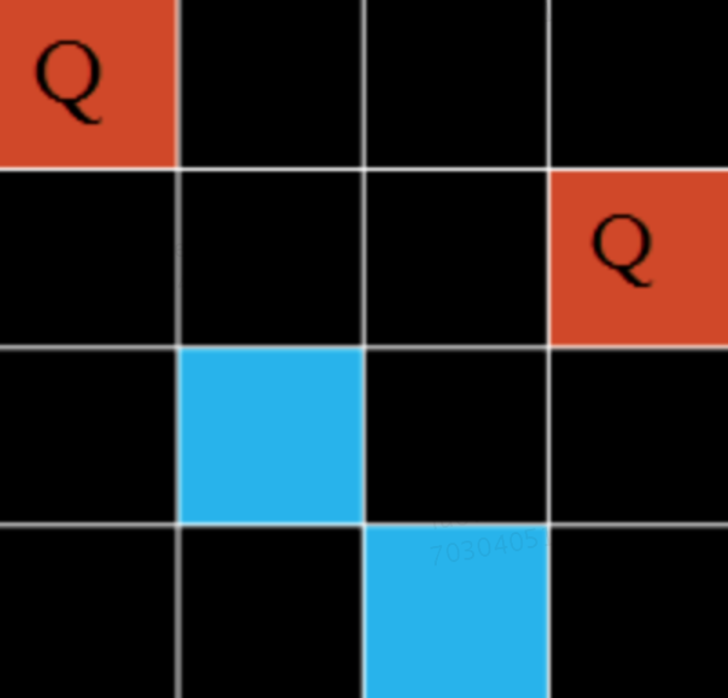

显然，第三个皇后只有一个位置可选。当第三个皇后占据第三行蓝色空位时，第四行皇后无路可走，于是发生错误，返回上层挪动3号皇后，而3号也别无可去，继续返回上层挪动2号皇后，2号已然无路可去，继续返回上层挪动1号皇后。于是1号皇后改变位置如下，继续搜索。

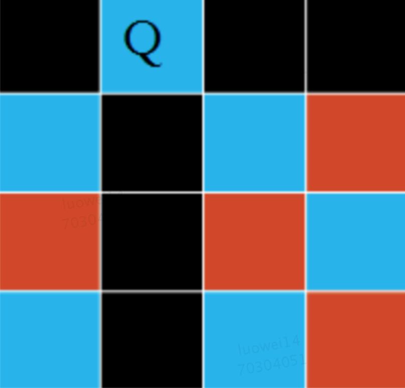

分析到这里，其实就已经有了一个基本的算法概念了：回溯法。

## 代码实现
### 1.姿势(1) 

```javascript
    // 皇后个数
    let n = 4
    // 当前行列放置状态
    let c= []
    // 一共有多少种方法
    let total = 0
    ​
    function queen(row) {
        for (let col = 0; col < n; col++) {
            // 设置当前行列放置状态
            c[row] = col
            // 检测当放置方式是否有冲突
            if (check(row)) continue
            if (row = n - 1) {
            total += 1
            } else {
            queen(row + 1)
            }
        }
    }
```

这段代码基本很好懂 主要就在两个判断上：假设我们有一个check函数，主要是用来检测黄后门是否有冲突，有冲突就跳出本次循环。如果能顺利放到最后一行（row === n - 1）证明这是一种有效的放置方法，总数+1，否则继续向下放置皇后（queen(row + 1)）

那么现在问题就在怎么实现check函数了，皇后冲突的条件无非三种：

- 列冲突
- 左侧斜向冲突
- 右侧斜向冲突

列冲突很好判断：只要判断两个皇后的纵坐标相同即可

斜向冲突怎么判断呢？

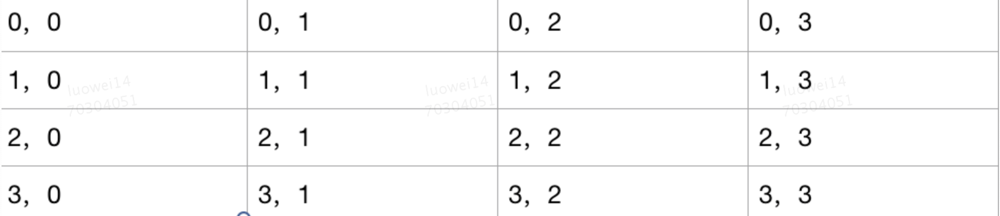

入上图所示，每个格子中，第一位数代表横坐标，第二位数代表纵坐标。2，1 即代表 第2行第1列，观察一下，左侧斜向冲突的坐标们有什么规律？

- 冲突1： 0，1；1，0
- 冲突2： 0，2；1，1；2，0
- 冲突3： 0，3；1，2；2，1；3，0

不难发现其中的规律

当两个皇后坐标 row + col 相等的时候，就代表两个皇后冲突了（左侧斜向）

同理很容易得出：当两个皇后坐标 row - col 相等的时候，两个皇后也冲突了（右侧斜向）

转换成代码：

```javascript
    function check(row) {
        for (let i = 0; i < row; i++) {
            // 列冲突
            if (c[row] === c[i]) return true
            // 左侧斜向冲突
            if (c[row] + row === c[i] + i) return true
            // 右侧斜向冲突
            if (c[row] - row === c[i] - i) return true
        }
        return false
    }
```
接下来我们验证一下 15 程序运行的时间：大约43S

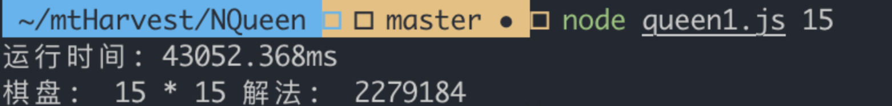

前面我们说过，主要是用的回溯法来解这道题的，那么回溯法体现在了哪？其实回溯的思想主要体现在了 queen 函数上

捋一下程序执行的过程：当row等于0的时候，col初始化为0，说明要在第0行第0列放置皇后，检测通过，进入else判断中，进入第1行，col初始化为0，检测冲突（列冲突）col++后检测依然冲突（右侧斜向），col继续++，检测通过，进入下一行循环执行代码。

当某种情况下无解呢？例如在4皇后问题中，0行0列是无解的，假设前面递归到queen(2)的时候，发现第2行无法放置皇后，当每个col检测冲突后，queen(1)的col自然而然的自增到下一列：即第1行的皇后从第1行第2列改变到第1行第3列。如此递归，当queen(0)的col自增到 n - 1，说明第一行的皇后已经从第0列遍历到第n - 1列，此时主函数执行完成，得到结果。

### 2. 姿势(2) 

当我们检测冲突的时候，实际上是检测每一列，如果我们能立即知道他所在的「列」、「斜向」是否被占用，就可以在O(1)的时间复杂度内检测冲突了，所以我们要在递归调用queen(row + 1)之前标记「列」、「斜向」为已占用。为此我们可以开辟三个空间来存储被占用情况；那么问题来了：如何表示被占用情况呢？我们给「列」起的接地气的变量:「竖」,「竖」被占用的情况应该是最简单的，假设我们有这样一个数组 Number[]，数组中的每一项代表当前列被占用情况，0 代表未占用，1 代表已占用，假设第3列被占用：arr[3] = 1。接下来是两个斜向，同样起个接地气的命名：左斜->撇（pie）；右斜->捺（na），那么如何表示「撇」和「捺」被占用呢？

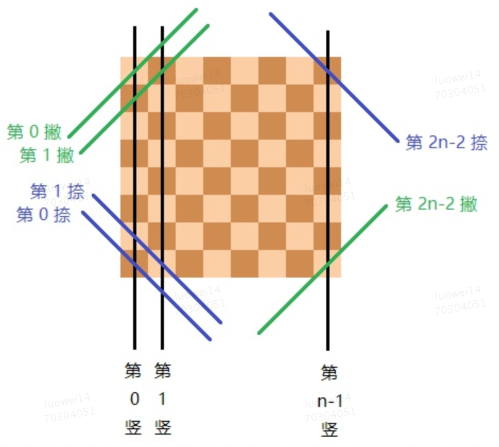

如上图所示，不难发现，「撇」和「捺」一共有 2n - 1 条，编号为 0 至 2n - 2 ，前面我们讲过，如何判断「撇」和「捺」是否冲突：【row + col】，【row - col】，那么我们可以给「撇」和「捺」这么定义编号

- 撇：row + col
- 捺：row - col （这里有一个小坑，我们后续会处理掉）

节省篇幅，给出主要代码

```javascript
    let shu = (new Array(n)).fill(0)
    let pie = (new Array(2 * n - 1)).fill(0)
    let na = (new Array(2 * n - 1)).fill(0)
    ​
    function queen(row = 0) {
        for (let col = 0; col < n; col++) {
            // 当前pie编号
            let j = row + col
            // 当前na编号
            let k = row - col
            // 检测冲突
            if(shu[col] || pie[j] || na[k]) continue
            if(row === n - 1) {
            total += 1
            } else {
            shu[col] = 1
            pie[j] = 1
            na[k] = 1
            queen(row + 1)
            shu[col] = 0
            pie[j] = 0
            na[k] = 0
            }
        }
    }
```
​
如上代码，我们用3个数组代替了for循环的检测，实际上是降低了时间复杂度，下面我们来验证下

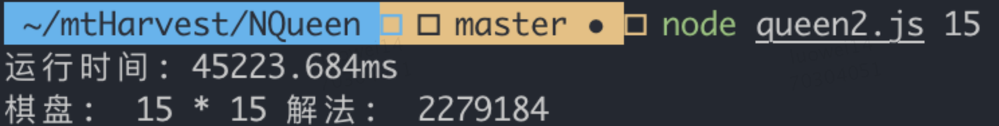

说好的极致优化呢？全特么是骗人的。。。 为什么我们明明降低了时间复杂度反升不降呢？我们机会回到代码中：解法1中，虽然我们用了一个for循环来检测冲突，但实际上只用了一个数组，只对这一个数组进行读和运算操作，反观解法2，用了3个数组，不断的进行的读写操作，尤其是在递归中，这种读写操作会被不断的放大，导致最终的运行时间反而不如for循环来的快。

### 3. 姿势(3) 

既然我们知道了瓶颈所在，那其实里解决问题也就不远了。回到解法2中，影响性能的是数组的读写操作，那有什么方式可以代替数组吗？？当然有：二进制 ，二进制天然的复合我们解法2中的数组操作：01010011 其中 0 依然代表未占用 1 代表被占用，接下来我们介绍一下二进制中的运算

> 与（&）            5 & 6 = 4  =>>  101 & 110 = 100 

> 或（|）             5 | 6 = 7    =>>   101 | 110 = 111

> 异或（^）        5  ^6 = 3    =>>    101 ^110 = 011

> 取反（~）        ~5 = -6     =>>     ~00000101 = 11111010    

> 左移（<<）     5 << 2 = 20 =>>  101 << 2 = 10100  

> 右移（>>）     5 >> 2 = 1  =>>    101 >> 2 = 1

基本的位运算规则不再赘述，我们来思考一个问题：数组中的操作无非是「读」和「写」，那么2进制中怎么来对应呢数组的 「读」「写」操作呢？下面我们看一下，如何在一个名为 arr 的 bit array中 读写特定的位：

> 把第 i 位置为 1：    arr |= (1 << i)

> 把第 i 位置为 0：    arr &= ~(1 << i)

> 把第 i 位置取反：    arr ^= (1 << i)

> 读取第 i 位的值：    (arr >> i) & 1

其实这些运算的规则并不难证明，我们的目的不是为了证明这些运算的正确与否，我们来看怎么结合到我们的题目当中来：既然我们决定用二进制的 bit array 代替数组，那其实只要把解法2中数组部分全部替换成bit array，操作部分全部替换成二进制的运算操作即可 

```javascript
    let shu = 0
    let pie = 0
    let na = 0
    let total = 0
    ​
    function queen(row = 0){
        for (let col = 0; col < n; col++){
            let j = row + col
            // 注意这里，因为 row - col 有可能是负数，位移一个负数比较麻烦，所以我们把 row - col 整体向右平移 n - 1，保证不会出现负数（思考： 为什么数组的负数下标也不受影响呢）
            let k = row - col + n - 1
            // 可以简化为 ((shu >> col) | (pie >> j) | (na >> k)) & 1
            if (((shu >> i) & 1) | ((pie >> i) & 1) | ((na >> i) & 1)) continue
            if (row === n - 1) {
                total += 1
            } else {
                shu |= (1 << col)
                pie |= (1 << col)
                na |= (1 << col)
                queen(row + 1)
                shu &= ~(1 << col)
                pie &= ~(1 << col)
                na &= ~(1 << col)
            }
        }
    }
```
大功告成，下面我们来检验一下是否真的有提升：

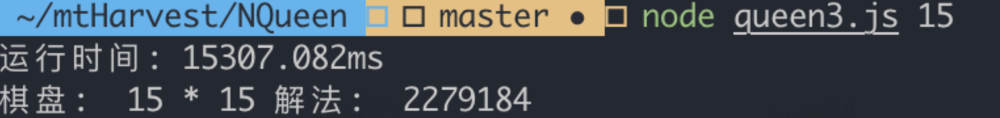

同样15个皇后，在解法2中，用了45S左右，而解法3只用了15S左右，瞬间提升了3倍多，位运算的优势一下子体现了出来

### 4. 姿势(4) 

其实算法的优化，无非几种思路，最主要的是 时间换空间、空间换时间 的思想，比如我们从解法1到解法2，从解法2到解法3，分别运用了这种思想，那除此之外就是从解题思路本身去寻找优化空间了。

从解法1到解法3，其实一直都存在一个限制因素：越到搜索深处，能放置的皇后其实越少了，但实际上我们一直都在每一列的进行试探。那能不能在试探之前，我们就知道到底有哪些可以放置的列呢？假设当前行可循环的列为 0011：其中1代表了可循环的列，0代表冲突，那其实我们要循环两次就可以了。那可循环的列应该怎么获取？把【shu】、【pie】、【na】中冲突的部分剔除掉，剩下的是不是就是可循环的列了？伪代码如下：

```javascript
    // 假设ava代表当前可循环的列 0011：其中1代表了可循环的列，0代表冲突
    ava = ~(shu | pie | na)
    while (ava) {
        if (row === n - 1){
            total += 1
        } else {
            // 标记占用
            queen(row + 1)
            // 清除标记
        }
    }
```
别的先不管，我们先来看下 「shu」、「pie」、「na」三个二进制占的位数，shu：n；pie：2n - 1, na: 2n + 1，经过『|』和『~』运算后也是2n -1 位，怎么看怎么不对呀？「shu」很好理解，就是等于n，我们重点关注下「pie」、「na」

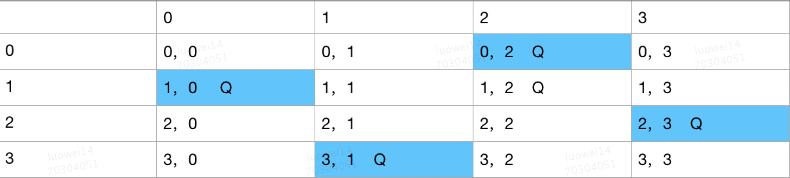

上图中，蓝色底色的格子代表皇后所在的位置，以「pie」为例，我们来分析一下：

「pie」的编号：row + col

- 第 0 行中 「pie」：    0000100
- 第 1 行中 「pie」：    0000010
- 第 2 行中 「pie」：    0100000
- 第 3 行中 「pie」：    0010000

有没有发现什么规律？相对于「pie」的编号来说，他是不是都被位移了「row」​ 位？那我们只要把位移的「row」位还原不就可以了？

还原：pie >> row

- 第 0 行中 「pie」：    0000100
- 第 1 行中 「pie」：    000001
- 第 2 行中 「pie」：    01000
- 第 3 行中 「pie」：    0010

从「pie」的编号低位向高位看，是不是正对应着上图中皇后的位置？注意：二进制的低位是从右开始，我们图中的位置是从左开始

接下来在分析一下「na」：

「na」的编号：row - col + n - 1，上面我们提到过：相对于「pie」的编号来说，二进制的 bit array 被位移了 row 位，那观察一下我们这个「na」的公式，相对于「na」来说，二进制的bit array被位移了多少位？相对于 「-col」位移了 row + n - 1位，那很容易得出：相对于「col」，位移了「1 - n - row」位，其实分析道这里，我们对「na」还原「1 - n - row」位是完全没有问题的，但是我们来观察一下这个还原公式「1 - n - row」：必定会出现负数的，负数的计算总是麻烦，还牵扯到了二进制，能不能把他干掉？回想我们解法2中，「na」的编号公式：row - col，调换个位置：col - row行不行？完全可行的啊，其实无论是row - col 还是col - row在意的都不是结果，而是在右侧斜向（「na」）上数字是否相等。那我们再从新看一下，在新的「na」编号公式中，相对于「col」，「na」被位移的多少位？显而易见，位移了「n - 1 - row」位，这会不存在负数了，舒服了。

「na」的编号：col - row + n - 1

- 第 0 行中 「pie」：    0100000
- 第 1 行中 「pie」：    0000100
- 第 2 行中 「pie」：    0010000
- 第 3 行中 「pie」：    0000010

还原：na >> n - 1 - row

- 第 0 行中 「pie」：    0100
- 第 1 行中 「pie」：    00001
- 第 2 行中 「pie」：    001000
- 第 3 行中 「pie」：    0000010

完美！现在我们把「shu」、「pie」、「na」都或起来再取反，就得到能循环的列了：~(shu | (pie >> row) | (na >> n - 1 - row))，细心的同学会发现，或完之后再取反，位数还是不对下，实际上我们有效的位数只有最右N位​ ，如何把前面无用的位数去掉呢？其实用 ((1 << n) - 1)再「&」上我们刚刚得到的结果，就可以把多余的位数去掉了。现在就剩下最后一个核心问题了：前面我们讲过，我们这次的优化，是想去循环那些没被占用的列，也就是我们bit array中是1​ 的那些位，可我们要怎么取出这些1​ 呢？教给大家一个low bit操作（简称LowB操作）：a & -a，原理其实并不难

```javascript
     a = 00110100
    -a = 11001100
a & -a = 00000100
```

low bit 操作可以用来枚举bit array中所有1的操作：

```javascript
    while (a) {
        let p = a & -a
        a ^= p
        console.log(p)
    }
```
这会所有问题都解决了，我们来看下核心代码

```javascript
    let shu = 0
    let pie = 0
    let na = 0
    let total = 0
    ​
    function queen(row = 0) {
        let ava = ((1 << n) - 1) & (~(shu | (pie >> row) | (na >> (n - 1 - row))))
        
        while(ava) {
            let p = ava & -ava
            // 每枚举一个1 都要把他清除掉
            ava ^= p
            
            if (row === n - 1) {
                total += 1
            } else {
                // 标记占用
                shu ^= p
                pie ^= (p << row)
                na ^= (na << (n - 1 - row))
                queen(row + 1)
                // 标记清除
                shu ^= p
                pie ^= (p << row)
                na ^= (na << (n - 1 - row))
            }
        }
    }
```
接下来我们再验证一下15个皇后运行的时间：

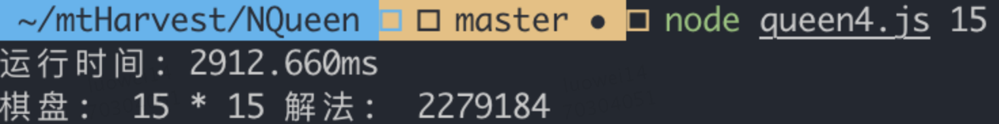

2.9S！！比解法3又快了5倍之多！

### 5. 姿势(5)​ 

最后，我们再来一次提升：

- 「shu」、「pie」、「na」采用传参的形式，不需要在另外单独传存储，也不需要标记清除了，减少一次运算操作

- 再来看「shu」、「pie」、「na」的编号，为什么这么繁琐？


如上图，第1行中，其实红色不能放置皇后的部分，就是第0行皇后的当前列，以及当前列左移、右移一位而已。

```javascript
    function queen(row = 0, shu = 0, pie = 0, na = 0) {
        let ava = ((1 << n) - 1) & ~(shu | pie | na)
        while (ava) {
            let p = ava & -ava
            ava ^= p
            
            if (row === n - 1) {
                total += 1
            } else {
                queen(row + 1, shu | p, (pie | p) >> 1, (na | p) << 1)
            }
        }
    }
```
再来测试一下运行时间：

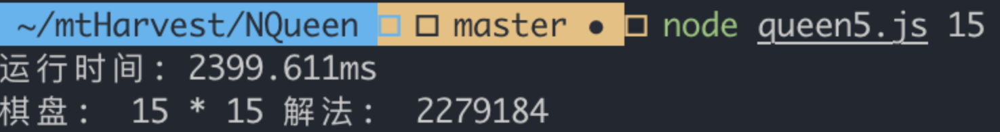

2.3S 比解法4中又快了 0.6S。

## 总结
以上就是本次为大家带来N皇后问题的5种解法，其实在我看来，后续的优化都是建立在解题思路的基础上，做出来的一些优化或者技巧，所以我觉得最重要的还是第一种解法，真正理解什么是回溯，怎么运用才是我们学习N皇后问题的根本。


### 参考
- [10394 用位运算速解 n 皇后问题](https://zhuanlan.zhihu.com/p/22846106)
- [小朋友学经典算法（14）：回溯法和八皇后问题](https://www.jianshu.com/p/797b2499b9f4)
- [位运算简介及实用技巧（三）：进阶篇(2)](http://www.matrix67.com/blog/archives/266)
- [回溯法](https://baike.baidu.com/item/%E5%9B%9E%E6%BA%AF%E6%B3%95/86074?fr=aladdin)
