## 问题描述

相传在古印度圣庙中，有一种被称为汉诺塔(Hanoi)的游戏。该游戏是在一块铜板装置上，有三根杆(编号A、B、C)，在A杆自下而上、由大到小按顺序放置64个金盘(如下图)。游戏的目标：把A杆上的金盘全部移到C杆上，并仍保持原有顺序叠好。操作规则：每次只能移动一个盘子，并且在移动过程中三根杆上都始终保持大盘在下，小盘在上，操作过程中盘子可以置于A、B、C任一杆上。

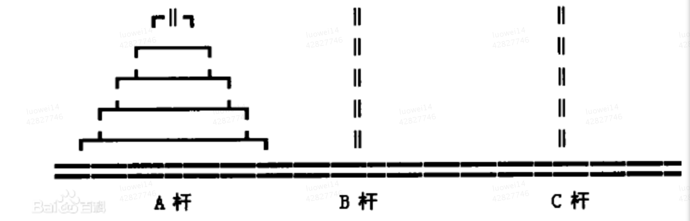

## 问题浅析

这是一个很有意思的益智游戏，我们先来玩儿一边这个游戏

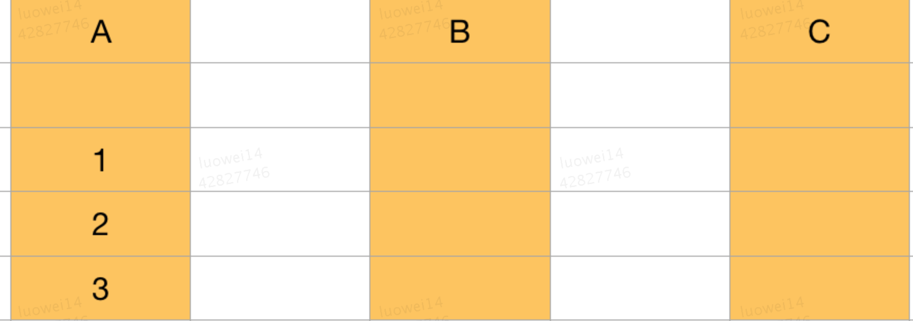

如上图所示，假设有A，B，C三根柱子，A中的1，2，3代表三个盘子及他们的编号，现在我们的目标是根据游戏规则，将A柱中的三个盘子移动到C柱上

第一步：将1号盘子移动到C柱上

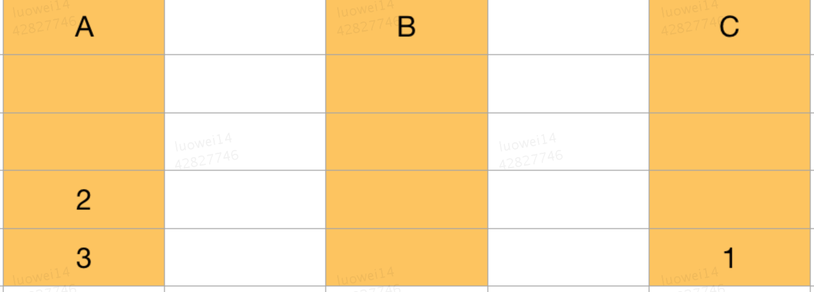

第二部：将2号盘移动到B柱上

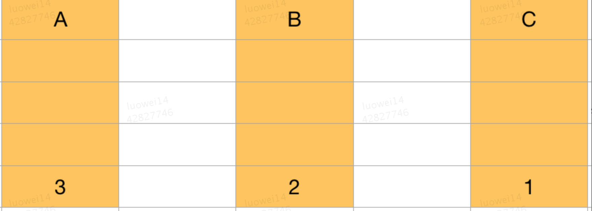

第三步：将1号盘移动到B柱上

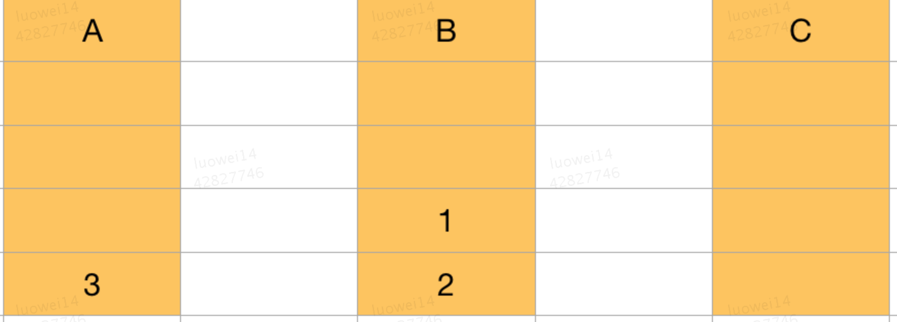

第四步：将3号盘移动到C柱上

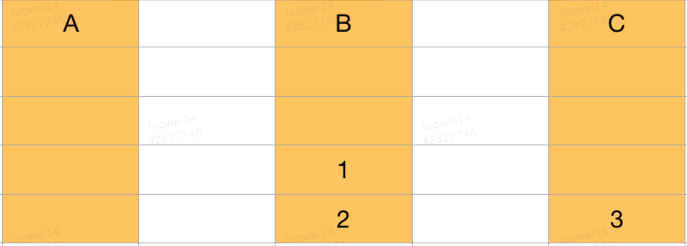

第五步：把1号盘移动到A柱上

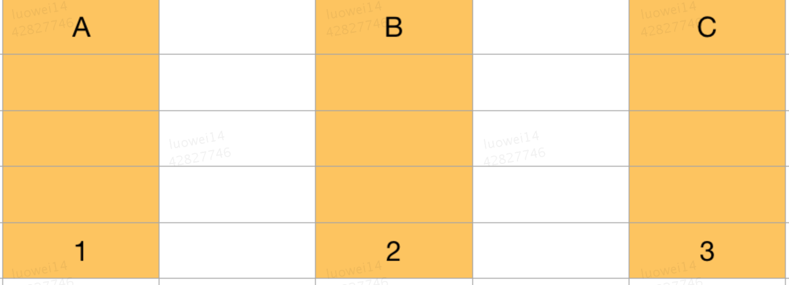

第六步：把2号盘移动到C柱上

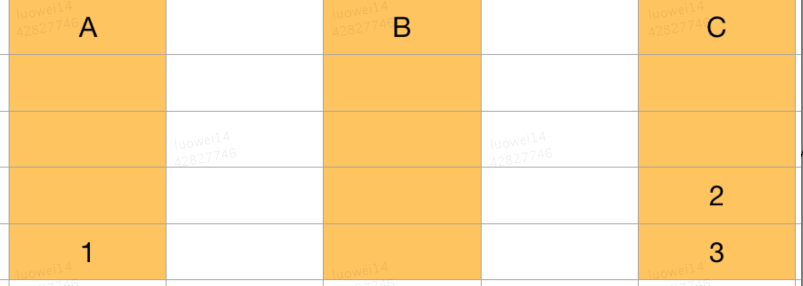

第七步：把1号盘移动到C柱上

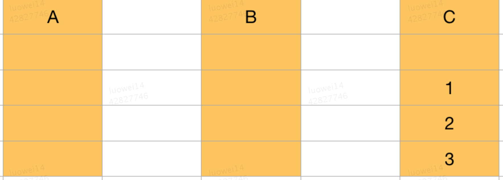

## 代码实现

从上面的游戏中我们应该能分析出一些规律：

1. B柱最为辅助，将A柱上的n-1个盘子移动到B柱上

2. 将A柱上的最后一个盘子移动到C柱上

3. A柱作为辅助，将B柱上的n-2个盘子移动到A柱上

4. 将B柱上的最后一个盘子移动到C柱上

以此类推...

### 递归解法

我们先实现一个简易的 hanoi 函数

```javascript
function print(n, from, to) {
    console.log(`将${n}号盘从 ${from} 移动到 ${to}`)
}

let hanoi = function (n, a, b, c) {
    if (n > 0) {
        // 将n - 1个盘子由a移动到b
        hanoi(n - 1, a, c, b)
        // 将最后一个盘子由a移动到c
        print(n, a, c)
        // 将n - 1个盘子由b移动到c 
        hanoi(n - 1, b, a, c)
    }
}
```

以上就是汉诺塔简易版的递归解法，可以说是最优雅的代码之一了。

我们把这个问题抽象一下：给定三个数组 A、B、C，数组A中有从小到大排列的元素[1，2，3]，如果每次只能操作一个元素，且在操作过程中，从小到大的顺序不变，问如何从A数组将所有元素移动到数组C？

```javascript
// 移动过程
function move(n, f, a, t) {
    let el = f.shift()
    t.unshift(el)

    console.log(n, f, a, t)
}

let hanoi = async function (n, arrA, arrB, arrC) {
    if (n > 0) {
        hanoi(n - 1, arrA, arrC, arrB)    

        move(n, arrA, arrB, arrC)

        hanoi(n - 1, arrB, arrA, arrC)
    }
}

hanoi(3, [1, 2, 3], [], [])
```

其实我们只是将简易版里的a、b、c替换成了三个数组，移动的过程实际上就是从某个数组的头部取出，再放入某个数组的头部。

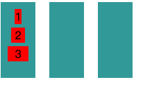

通过上面的动图我们可以清晰的看到每一步的变化。

### 非递归解法

非递归的解法有几种，比如二叉树、奇偶解等。我们的非递归解法采用奇偶解。

汉诺塔的非递归算法描述如下：

首先容易证明，当盘子的个数为n时，移动的次数应等于2^n - 1。

一位美国学者发现一种出人意料的方法，只要轮流进行两步操作就可以了。

首先把三根柱子按顺序排成品字型，把所有的圆盘按从大到小的顺序放在柱子A上。

根据圆盘的数量确定柱子的排放顺序：若n为偶数，按顺时针方向依次摆放 A B C；

若n为奇数，按顺时针方向依次摆放 A C B。

（1）按顺时针方向把圆盘1从现在的柱子移动到下一根柱子，即当n为偶数时，若圆盘1在柱子A，则把它移动到B；

若圆盘1在柱子B，则把它移动到C；若圆盘1在柱子C，则把它移动到A。

（2）接着，把另外两根柱子上可以移动的圆盘移动到新的柱子上。

即把非空柱子上的圆盘移动到空柱子上，当两根柱子都非空时，移动较小的圆盘

这一步没有明确规定移动哪个圆盘，你可能以为会有多种可能性，其实不然，可实施的行动是唯一的。

（3）反复进行（1）（2）操作，最后就能按规定完成汉诺塔的移动。

```javascript
function hanoi(n , arrA, arrB, arrC) {
    let loop = new Array(arrA, arrB, arrC)
    // 用于定位奇偶
    let x = n % 2 != 0 ? 2 : 1
    // 移动次数
    let count = 2 ** n - 1
    // 一号盘的位置
    let firstPlate = 0

    console.log('start: ', ...loop)

    while(count != 0) {
        loop[(firstPlate + x) % 3].unshift(loop[firstPlate].shift())
        // 更新一号盘位置
        firstPlate = (firstPlate + x) % 3
        count--

        if (count !== 0) {
            // 另外两个盘子如何移动

            /**
             * 1号盘子的后第1个位置为空，或者无空位置且1号盘子后第2个位置编号较小，此时将1号盘子后第2个位置的盘子移动到1号盘子后第1个位置上
             * 1号盘子的后第2个位置为空，或者无空位置且1号盘子后第1个位置编号较小，此时将1号盘子后第1个位置的盘子移动到1号盘子后第2个位置上  
             */
            if (
                loop[(firstPlate + 1) % 3].length === 0 ||
                loop[(firstPlate + 2) % 3].length !== 0 &&
                loop[(firstPlate + 2) % 3][0] < loop[(firstPlate + 1) % 3][0]
            ) {
                loop[(firstPlate + 1) % 3].unshift(loop[(firstPlate + 2) % 3].shift())
            } else {
                loop[(firstPlate + 2) % 3].unshift(loop[(firstPlate + 1) % 3].shift())
            }
            count--
        }
    }

    console.log('end: ', ...loop)
}
```

非递归的解法就是按照规律，不断的重复 取出->插入 的步骤。

## 总结

递归方法与非递归想法对比有一个很有意思的地方：

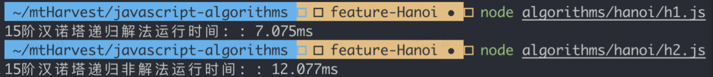

如上图，与N皇后问题不同，对于汉诺塔问题的求解，当使用递归的方法来解决时它的时间复杂度比非递归的方法要好。而且，使用递归算法写代码时更容易理解。通过对于汉诺塔问题非递归与递归方法的对比可以得出结论：有的时候使用的递归的方法对于问题的求解不仅更能使人容易理解，而且效率更高。我们在以后编代码时也应该注意递归方法的使用。

## 参考
- [汉诺塔递归分析和非递归算法](https://blog.csdn.net/z294155673/article/details/52083319)
- [数据结构与算法题目集7-17——汉诺塔的非递归实现](https://blog.csdn.net/qq_41231926/article/details/84727366)
- [汉诺塔问题的递归和非递归算法](https://blog.csdn.net/computerme/article/details/18080511)
- [汉诺塔非递归算法](https://blog.51cto.com/mengliao/534053)