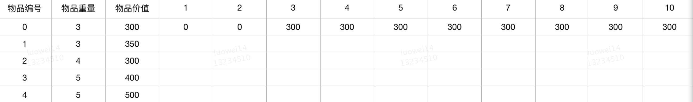

## 问题描述

给定一组物品，每种物品都有自己的重量和价格，在限定的总重量内，我们如何选择，才能使得物品的总价格最高。问题的名称来源于如何选择最合适的物品放置于给定背包中。相似问题经常出现在商业、组合数学，计算复杂性理论、密码学和应用数学等领域中。也可以将背包问题描述为决定性问题，即在总重量不超过W的前提下，总价值是否能达到V？它是在1978年由Merkel和Hellman提出的。（摘自百度百科）

背包问题其实是一类问题，比如爬台阶（N级台阶每次爬1-2级）、国王与金矿等问题，本质上跟背包问题是相同的。我们今天研究的背包问题如下：

`给出一组物品，每种物品有自己的重量和价值，问在给定的背包承重内，如何使物品总价值最高？`

## 问题浅析

这次的解析跟上次有所不同，在分析问题之前，我们先来聊聊：递归和动态规划。

- 递归

什么是递归？先下定义：`递归算法是一种直接或者间接调用自身函数或者方法的算法。`

通俗来说，递归算法的实质是把问题分解成规模缩小的同类问题的子问题，然后递归调用方法来表示问题的解。它有如下特点：

- 一个问题的解可以分解为几个子问题的解

- 这个问题与分解之后的子问题，除了数据规模不同，求解思路完全一样

- 存在递归终止条件，即必须有一个明确的递归结束条件，称之为递归出口

比如爬台阶问题：

有N级台阶，每次爬1或2级，问有多少种方法能爬完？

通过递归的思想很容易求得解法：

假设我们最后一级台阶是走了1步，那剩余的爬法应该f(n - 1)，假设我们最后爬了2步，那剩余的爬法应该是f(n - 2)，总共有多少种爬法？显然是f(n) = f(n - 1) + f(n - 2)

其实我们在把f(n)划分 f(n - 1) 、f(n - 2)就是一个拆解子问题的过程，而且子问题的求解思路其实和我们原本的问题求解思路一模一样，那现在就只缺少终止条件了，对于这到题目来说，终止条件很简单，无非是只有1级台阶和有2级台阶的时候，最后我们转换成代码就可以了

```javascript
function jump(n) {
    if (n <= 1) return 1
    if (n <= 2) return 2
    return jump(n - 1) + jump(n - 2)
}
```

## 动态规划

### 分治

解释动态规划的时候我们先来了解下分治策略：

将原问题分解为若干个规模较小但类似于原问题的子问题（Divide），「递归」的求解这些子问题（Conquer），然后再合并这些子问题的解来建立原问题的解。

### 动态规划

动态规划其实和分治策略是类似的，也是将一个原问题分解为若干个规模较小的子问题，递归的求解这些子问题，然后合并子问题的解得到原问题的解。区别在于这些子问题会有重叠，一个子问题在求解后，可能会再次求解，于是我们想到将这些子问题的解存储起来，当下次再次求解这个子问题时，直接拿过来就用。其实就是说，动态规划所解决的问题是分治策略所解决问题的一个子集，只是这个子集更适合用动态规划来解决从而得到更小的运行时间。即用动态规划能解决的问题分治策略肯定能解决，只是运行时间长了。因此，分治策略一般用来解决子问题相互对立的问题，称为标准分治，而动态规划用来解决子问题重叠的问题。

我们依然用爬台阶的问题举例，观察一下台阶数与走法数的规律：


有没有发现，从第3级台阶开始，走法数等于前两级台阶走法数之和，由前两级台阶走法推导出下一级台阶的走法，那其实我们把前两级的台阶缓存下来就可以了

```javascript
function jump(n) {
    if (n <= 1) return 1
    if (n <= 2) return 2
    
    let a = 1; let b = 2;
    let tmp
    for (let i = 3; i <= n; i ++) {
        tmp = a + b
        a = b
        b = tmp
    }
    return tmp
}
```

在递归解法中，爬台阶的时间复杂度如图


这种方法的时间复杂图不难算出：O(2 ^ n)

而在换做动态规划的解法后，时间复杂度降为O(n)。

**注：并不是所有的动态规划解法就一定会比递归解法更优，爬台阶问题只是一个简单的一个维度的问题，具体还要看有哪些影响维度，有多大数据量等。** 

## 解题方法

> 背包问题又可以划分为【01背包】、【完全背包】、【多重背包】

### 01背包

01背包就是我们典型的背包问题，每种物品要么放，要么不放，不存在第三种情况，我们尝试用递归 和 动态规划两种思路去寻找答案。

- 递归

其实递归解题有一套自己的套路：

1. 拆分子问题

2. 推导递推公式

3. 边界

我们就按着这个步骤来看一下01背包问题：

1. 拆分子问题

假设 F(w, t)代表有w种物品在t的限定下的最优价值，比如有这样一组物品 [1, 2, 3]，对应的价值为[2, 3, 4], 背包限重5，我们想求F([1, 2, 3], 5)，可以这么去拆分：

- 假设最后一种不放，那就是：求F([1, 2], 5)的最优值

- 假设最后一种物品放，那就是：求F([1, 2], 5 - 3) + 3

解释一下上面的拆分：其实就是通过最后一种物品放置与否，来求的两种放置方法的最优值，如果最后一种物品不放，那就刨除最后一个物品，剩下的物品在限重中求得一个最优值，如果最后一种物品放置，那把最后一种物品所占的重量减去之后，求剩下的物品的最优值+最后一个物品的价值，取两种放置方法的最大值即可

2. 递推公式

递推公式可以从拆分的子问题里来推导出来： F(w, t) = Max(F(w - 1, t), F(w - 1, t - w[last]) + v[last]) 

3. 边界

对于这个问题来说，边界情况应该有如下4种：

 a. 只有一个物品，且物品的重量小于背包的承重，F(w, t) = v[0]

 b. 只有一个物品，且物品的重量大于背包的承重，F(w, t) = 0

 c. 物品数量大于1，且最后一个物品的重量小于背包承重，F(w, t) = Max(F(w - 1, t), F(w - 1, t - w[last]) + v[last]) 

 d. 物品数量大于1，且最后一个物品的重量大于背包承重，F(w, t) = F(w - 1, t)

最后转化成代码即可
```javascript
// 物品的重量
let W = [3, 3, 4, 5, 5]
// 物品的价值
let V = [ 300, 350, 300, 400, 500]
// 背包承受总重
let TW = 10

// 递推公式
// F(w, t) = Max(F(w - 1, t), F(w - 1, TW - w[last]) + v[last])

// 边界
/**
 * 1. 只有一个物品，且物品的重量小于背包重量：F(w, t) = v[0]
 * 2. 只有一个物品，且物品的重量大于背包重量：F(w, t) = 0
 * 3. 物品数量大于1，且最后一个物品占用重量小于背包总重：F(w, t) = Max(F(w - 1, t), F(w - 1, TW - w[last]) + v[last])
 * 4. 物品数量大于1，且最后一个物品占用重量大于背包总重：F(w, t) = F(w - 1, t)
 */

function foo(w, v, t) {
    if (w.length === 1 && w[0] <= t) return v[0]
    if (w.length === 1 && w[0] > t) return 0

    if (w.length > 1 && w[w.length - 1] <= t) {

        let arrW = [...w]
        let lastW = arrW.pop()
        let arrV = [...v]
        let lastV = arrV.pop()
        return Math.max(foo(arrW, arrV, t), foo(arrW, arrV, t - lastW) + lastV)
    }

    if (w.length > 1 && w[w.length - 1] > t) {
        w.pop()
        v.pop()

        return foo(w, v, t)
    }

}
```
- 动态规划

动态规划的解题其实也有一套套路，我们先来张表分析下



只有一个物品时，只要当背包承重大于该物品重量就达到了最大价值，即v[0] = 300


两个物品时，当背包承重小于任意物品重量，此时背包价值都为0，当背包承重到3时，大于物品的重量，这里我们两个物品的重量恰好同种，取价值较高的一个即可，当背包承重到6时，说明两个物品都能放下了，最大价值即v[0] + v[1] = 300 + 350 = 650


三个物品时，背包承重6之前的没变化，大于6且小于等于9时，放不下第三个物品（第三个物品重量为4），当背包承重为10时，正好能放下第4个物品，此时背包达到最大价值：v[0] + v[1] + v[2] = 300 + 350 + 300 = 950


四个物品，背包承重4之前没变化，依然是物品1的价值最大（350），当背包承重到5的时候，物品3的价值变成了最大值：400，承重为6的时候，最大价值为v[0] + v[1] = 650，承重为8的时候，650不是最大的啦，因为v[3] + v[1] = 750 > v[0] + v[1] = 650，同理背包承重到10的时候，最大值为v[0] + v[1] + v[2]


五个物品的计算方法跟四个的一模一样，只不过已经没有大于950的选择，所以5个物品最大价值为950

我们来分析一下这张表，假设我想知道表中某行某列的值，该怎么求？不难发现，除第一行外，其实某行某列的值应该是跟上一行的某一个或两个值有关。

假设我们想知道第2行第6列的值，该怎么求？应该是Max(第1行第6列，第2第3列 + 第1行第3列)

如果想求第3行第6列的值，那应该是Max(第2行第6列, 第3行第5列 + 第2行第3列)，其实跟我们递归解法中的递推公式是一样的

我们的动态规划的思路已经出来了：

- 最优子结构

问题的最优解包含子问题的最优解。反过来说就是，我们可以通过子问题的最优解，推导出问题的最优解。对于我们这道题来说，最优子结构就是 f(第5行第10列) = Max(第4行第10列, 第4行第5列 + 第5行第5列)

- 边界条件

边界条件就很好理解了，比如我们表格中价值为0的都是一些边界条件

- 状态转移

状态转移又分为两种：状态表转移和状态方程转移，状态方程转移其实跟递归求解很像，递推方程就是状态转移方程。我们刚才分析问题个过程是状态表转移，只要把分析的过程翻译成代码就是状态表转移了。

```javascript
// 物品的重量
let W = [3, 3, 4, 5, 5]
// 物品的价值
let V = [ 300, 350, 300, 400, 500]
// 背包承受总重
let T = 10
let test = []

function foo() {
    let prev = []
    let current = []

    // 第一行
    for(let i = 0; i < T + 1; i++){
        if (i < W[0]) {
            prev.push(0)
        } else {
            prev.push(V[0])
        }
    }
    test.push([...prev])
    for (let i = 1; i < W.length; i++) {
        for (let j = 0; j < T + 1; j++) {
            if (j < W[i]) {
                current[j] = prev[j]
            } else {
                current[j] = Math.max(prev[j], (prev[j - W[i]] + V[i]))
            }
        }
        test.push([...current])
        for (let j = 0; j < T + 1; j++) {
            prev[j] = current[j]
        }
        
    }
    return current[T]
}
```

上面的代码其实还可以优化下，实际上我们用一个数组来存贮物品信息即可，替换物品信息的操作实际上都在这一个数组里面进行的

```javascript
// 物品的重量
let W = [3, 3, 4, 5, 5]
// 物品的价值
let V = [ 300, 350, 300, 400, 500]
// 背包承受总重
let T = 10

/**
 * 这种方法本质上其实是对index1.js里方法的优化
 * 1方法中我们用了两个数组，分别代表上一行（prev）和当前行（current）
 * 但实际上我们完全可以只用一个数组来操作，本质上就是数组中的【元素替换】，其实大可不必再用另一个数组（prev）来做临时存储
 */

function foo() {
    let k = []

    for (let i = 0; i < T + 1; i++) {
        k.push(i < W[0] ? 0 : V[0])
    }
    // console.log(k)
    for (let i = 1; i < W.length; i++) {
        /**
         * 注意这里的倒序循环
         * 为什么要用倒序？注意 j - W[i] 这里，假设我们用正序循环，j - W[i]是一定会出现负数的
         * 我们在解法1中是有if (j < W[i]) 的判断的，假设判断成立其实k中对应的那个元素是不用变化的
         * 假设用正序循环，循环的终止条件必然是 j < T + 1，完全没有办法避免j - W[i] < 0的情况
         * 所以这里我们采用倒序，循环的终止条件其实就是j > W[i]，那对于j < W[i]的情况怎么办？
         * 其实我们刚刚已经说过了 如果j < W[i]，k中的元素是不用变化的，解法1中只不过是将这种不用替换写成了一个等价交换：current[j] = prev[j] 意思是一样的
         */
        for (let j = T; j >= W[i]; j--) {
            k[j] = Math.max(k[j], k[j - W[i]] + V[i])
        }
        // console.log(k)
    }
    return k[T]
}
```

这种解法需要注意内层的循环以及判断条件，注释里面详细写了为什么这么做。

### 完全背包

完全背包与01背包不同的是，完全背包中的物品有无数个，可以无限放。我们还是用表来分析一下


同样2个物品看一下01背包


在第2行第6列的时候，01背包与完全背包发生了变化，原因是01背包只能放一种物品，而完全背包在放完了价值较大的一种物品后可以继续放这种物品，那其实就给我们提供了一种思路，只要每次都放价值最大的物品即可满足完全背包的问题了，我们来看代码

```javascript
// 物品的重量
let W = [3, 3, 4, 5, 5]
// 物品的价值
let V = [ 300, 350, 300, 400, 500]
// 背包承受总重
let T = 10

function foo() {
    let k = []

    for (let i = 0; i < T + 1; i++) {
        k.push(Math.floor(i / W[0]) * V[0])
    }
    // console.log(k)
    for (let i = 1; i < W.length; i++) {
        for (let j = W[i]; j < T + 1; j++) {
        		// if (j === 7) {
            //     console.log(
            //         k, j, i, '---',
            //         k[j], k[j - W[i]] + V[i], '^^^',
            //         k[j - W[i]], V[i], k[j - W[i]] + V[i]
            //     )
            // }
            k[j] = Math.max(k[j], k[j - W[i]] + V[i])
        }
        console.log(k)
    }

    return k[T]
}
```

与01背包的解法中，只有一行代码的区别 `let j = W[i]; j < T + 1; j++` , 循环里面的边界条件和自增没什么好解释的，主要看一下初始值为什么是 `W[i]` ,实际上就是我们刚刚提到的: 每次都放价值最大物品，`W[i]`之前的物品价值实际上都是我们计算过的，都是最优的，所以无需再做任何操作。完全背包问题光从逻辑上想是比较费解的，我们可以去尝试在内层循环里面输出每一行的信息，来辅助理解我们的解题思路，能达到事半功倍的效果。我在代码的注释里面标明了当完全背包和01背包发生变化的操作，你可以打印出来看一下。

### 多重背包

最后再来看一下多重背包的问题，多重背包跟01背包的区别是每种物品可以放置规定数量个，多重背包相对来说比较简单，可以转化为01背包，用01背包的解法去解。

```javascript
// 物品的重量
let W = [3, 3, 4, 5, 5]
// 物品的价值
let V = [300, 350, 400, 400, 500]
// 每件物品个数
let N = [2, 3, 1, 2, 2]
// 背包承受总重
let T = 10

// 转化成01背包
function trans() {
    let r = {
        w: [],
        v: []
    }

    N.forEach((item, i) => {
        for (let j = 0; j < item; j++) {
            r.w.push(W[i])
            r.v.push(V[i])
        }
    })

    return r
}

let transK = trans()

// console.log(transK)

function foo(w, v, t) {
    let k = []

    for (let i = 0; i < t + 1; i++) {
        k.push(i < w[0] ? 0 : v[0])
    }

    for (let i = 1; i < w.length; i++) {
        for (let j = t; j > w[i]; j--) {
            k[j] = Math.max(k[j], k[j - w[i]] + v[i])
        }
        // console.log(k)
    }
    return k[t]
}

console.log(foo(transK.w, transK.v, T))
```

## 总结

在理解动态规划之前我们先介绍了递归，递归算法是一种直接或者间接调用自身函数或者方法的算法。递归的套路：

- 拆分子问题

- 推导递推公式

- 边界

用递归解决的问题是自上而下的，无论是我们之前介绍的爬台阶问题 还是 01背包问题，递归的解法都是自上而下的把问题一级一级的拆分下去的，然后再合并这些子问题的解来建立原问题的解。

动态规划正好跟递归相反，动态规划是自下而上的推导，根据上一级结果推导出下一级结果，在推导过程中解决了很多重复计算的问题。动态规划也有一套解题套路：

- 最优子结构

- 边界

- 状态转移

什么样的问题适合用动态规划来解呢？其实可以根据 `一个模型三个特征` 来分析

- 一个模型

它指的是动态规划适合解决的问题的模型。我们称为 多阶段决策最优解模型 。我们一般是用动态规划来解决最优问题。而解决问题的过程，需要经历多个决策阶段。每个决策阶段都对应着一组状态。然后我们寻找一组决策序列，经过这组决策序列，能够产生最终期望求解的最优值。

- 三个特征

 1. 最优子结构

最优子结构指的是，问题的最优解包含子问题的最优解。反过来说就是，我们可以通过子问题的最优解，推导出问题的最优解。如果我们把最优子结构，对应到我们前面定义的动态规划问题模型上，那我们也可以理解为，后面阶段的状态可以通过前面阶段的状态推导出来。

 2. 无后效性

无后效性有两层含义，第一层含义是，在推导后面阶段的状态的时候，我们只关心前面阶段的状态值，不关心这个状态是怎么一步一步推导出来的。第二层含义是，某阶段状态一旦确定，就不受之后阶段的决策影响。无后效性是一个非常“宽松”的要求。只要满足前面提到的动态规划问题模型，其实基本上都会满足无后效性。

3. 重复子问题

这个概念比较好理解：不同的决策序列，到达某个相同的阶段时，可能会产生重复的状态。 

如果满足以上 `一个模型三个特征` 就基本可以用动态规划来解。

## 参考

- [动态规划理论：一篇文章带你彻底搞懂最优子结构、无后效性和重复子问题](https://time.geekbang.org/column/article/75702)
- [看动画轻松理解「递归」与「动态规划」](https://cxyxiaowu.com/articles/2019/04/04/1554345266086.html)
- [背包问题：0-1背包、完全背包和多重背包](https://www.cnblogs.com/fengziwei/p/7750849.html)
- [编程之美---背包问题详解：01背包、完全背包、多重背包](https://blog.csdn.net/qq_38906523/article/details/79813016)
- [小朋友学经典算法（16）：动态规划之背包问题](https://www.jianshu.com/p/8fb126d49abf)
- [动态规划学习-【国王和金矿】](https://blog.csdn.net/program_developer/article/details/82846180)
- [漫画：什么是动态规划？](https://juejin.im/post/5a29d52cf265da43333e4da7)
- [背包问题](https://baike.baidu.com/item/%E8%83%8C%E5%8C%85%E9%97%AE%E9%A2%98/2416931?fr=aladdin)
- [动态规划](https://baike.baidu.com/item/%E5%8A%A8%E6%80%81%E8%A7%84%E5%88%92/529408?fr=aladdin)