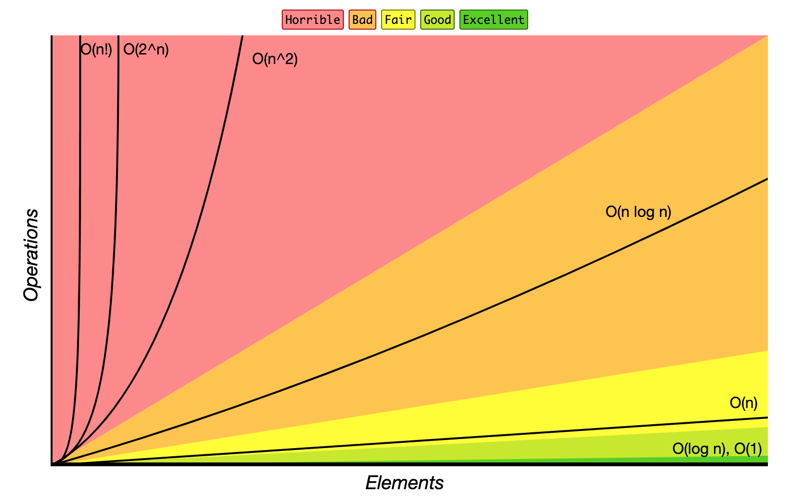

# JavaScript经典算法

本库记录了一些经典的算法题，每道经典算法题下都有详细的讲解，并给出JS执行代码，目的是为了让更多了前端小伙伴了解算法，理解算法背后的原理。

`注：本项目仅供学习和研究，如果你发现有题目中有哪些错误，欢迎在`[Issue](https://github.com/lvvlan/javascript-algorithms/issues)`中指正，如果有不懂的地方也欢迎向我提问，我都会尽力解答。`

## 如何使用

### start

> 依赖[Vue CLI 3](https://cli.vuejs.org/zh/guide/prototyping.html)
    
    cd algorithms/xxx
    vue serve

### build

> 依赖[Vue CLI 3](https://cli.vuejs.org/zh/guide/prototyping.html)

    cd algorithms/xxx
    vue build

### 题目

 - [N皇后问题](./algorithms/NQueen/readme.md)

## 一些关于算法的信息

### 大O符号

大O符号中指定的算法的增长顺序。

源: [Big O Cheat Sheet](http://bigocheatsheet.com/)

常用大O标记法列表和输入的数据的性能比较。

| 大O标记法      | 计算10个元素                 | 计算100个元素                 | 计算1000个元素                  |
| -------------- | ---------------------------- | ----------------------------- | ------------------------------- |
| **O(1)**       | 1                            | 1                             | 1                               |
| **O(log N)**   | 3                            | 6                             | 9                               |
| **O(N)**       | 10                           | 100                           | 1000                            |
| **O(N log N)** | 30                           | 600                           | 9000                            |
| **O(N^2)**     | 100                          | 10000                         | 1000000                         |
| **O(2^N)**     | 1024                         | 1.26e+29                      | 1.07e+301                       |
| **O(N!)**      | 3628800                      | 9.3e+157                      | 4.02e+2567                      |

